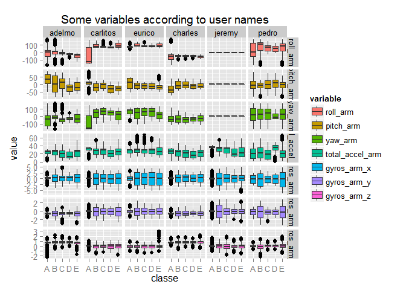

# COURSERA: Practical ML Assignment
Tomas Matyska  
Sunday, November 23, 2014  

Using devices such as Jawbone Up, Nike FuelBand, and Fitbit it is now possible to collect a large amount of data about personal activity relatively inexpensively. These type of devices are part of the quantified self movement – a group of enthusiasts who take measurements about themselves regularly to improve their health, to find patterns in their behavior, or because they are tech geeks. One thing that people regularly do is quantify how much of a particular activity they do, but they rarely quantify how well they do it. In this project, our goal is to use data from accelerometers on the belt, forearm, arm, and dumbell of 6 participants. They were asked to perform barbell lifts correctly and incorrectly in 5 different ways. The main research question is whether we are able to distinguish these five ways using only the accelerometer data. 

## Setting the stage


I already downloaded the data, so let us load them from the file. Anyway it is possible to change the path to url address and it will also work. First file is the training dataset that I will use for training and validation of the model. The second file provides an additional test set for which I classified the activities and send them to Coursera for evaluation.

```r
# Training dataset
file<-'C:/Tomas/skola/Internet Courses/Data Science Specialization/08 Practical Machine Learning/pml-training.csv'
train_orig<-read.csv(file)

# Testing dataset
file<-'C:/Tomas/skola/Internet Courses/Data Science Specialization/08 Practical Machine Learning/pml-testing.csv'
test_orig<-read.csv(file)
```


## Exploratory analyis and data preparation

First,let us see the data:

```r
# View data
View(train_orig)
View(test_orig)
```

On the first sight we can see that there are some variables missing for some datapoints. These variables are filled in only if the new_window variable is 'yes'. Since these rows are very rare in the dataset, I decided to leave them out. This means that I will leavo out also all the variables whose name started by max/min/avg/amplitude/skewness/kurtosis/stddev/var since these variables are now useless.


```r
# Subsetting
train_subset<-train_orig[train_orig$new_window=="no",!colnames(train_orig) %in% grep("(max|min|avg|amplitude|skewness|kurtosis|stddev|var)\\_", names(train_orig), value = TRUE)]
```

For a quick look, I use ggplot splitted by  the variable and the user that performs the activity. Nevrtheless, these charts do not show anything much interesting.


```r
# Ggplot
e2<-melt(train_subset[,c(21:27, which(colnames(train_subset)=="classe"), which(colnames(train_subset)=="user_name"))], id=c("classe","user_name"))
ggplot(e2, aes(x=classe, y=value, fill=variable)) + 
  geom_boxplot() +
  ggtitle("Some variables according to user names") + facet_grid( variable ~ user_name, scales="free")
```

 

## Crossvalidation: Split train and test sets
Even though I will use models where cross-validation is built-in, I split the data into training and testing set to confirm that the model does not overfit.


```r
## setting the proportion of training sample to 60%
smp <- floor(0.6 * nrow(train_subset))

## Seed ensures that the partition is reproducible
set.seed(12345)

## Partitioning
train_ind <- sample(seq_len(nrow(train_subset)), size = smp)

train <- train_subset[train_ind, ]
test <- train_subset[-train_ind, ]
```

## Modeling: Random forests
I build a random forest model to predict the type of activity. For validation I use the K-fold validation that is built into the Caret package. Finally, I fit the model to the training set.


```r
## Set trainControl
tc <- trainControl("oob", number=3, repeats=3, classProbs=TRUE, savePred=T) 

## Do the modeling
RFFit <- train(classe ~., data=train, method="rf", trControl=tc, preProc=c("center", "scale"))
```

## Validation on a test set
I tried the model on the validation set I kept aside. The model performed very well with almost all matches!

```r
## Do the prediction
test$prediction <- predict(RFFit, newdata = test)

## Count matches
test$match <- (test$classe == test$prediction)
ddply(test, c("match"),  summarise, freq=length(match), .progress='win')
```

```
##   match freq
## 1 FALSE    1
## 2  TRUE 7686
```

## Prediction of the true testing set
Finally, I use the model to predict the 20 test cases given in the Coursera original testing dataset. I generated the submission files according to the assignment description and I submitted them. From some reason the model is not OK.

```r
# Subsetting
test_subset<-test_orig[test_orig$new_window=="no",!colnames(test_orig) %in% grep("(max|min|avg|amplitude|skewness|kurtosis|stddev|var)\\_", names(test_orig), value = TRUE)]

# Prediction
test_subset$prediction <- predict(RFFit, newdata = test_subset)
```
